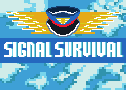

## Changes after deadline
- 24.04.2026 fixed input not getting captured by using click to start instead of space and changed texts to show that

----

## Description
Join your fellow birdmates on a risky journey through bad radio signals, evil goshawks an dangerous cargoplanes. Your Mission is to find the isles of wellness, which will lead you to the glorious south, the final destination for all fellow birdmates.

----

Lead a flock of birds to safety as the guiding bird. 
Gather pigeons, seagulls, and migrating birds to escort them to their sanctuary, where they’ll continue their journey south.

But the skies are no longer peaceful. Escape from hungry birds of prey and  dangerous technology like the occasional airplane and radio tower signals which will confuse your flock.

Guide your birds home and survive the chaos of the modern world.

----

## Controls

Click - anywhere to move your bird to that location 

Shift - for a quick spedboost to dodge dangers and radar signals

1 - Use Ability 1 -> Regular birds sacrifice themselves against predators.

2 - Use Ability 2 -> Seagulls attack using "aerial droppings".

3 - Use Ability 3 -> Pigeons can cloak your formation from radio towers.

---- 

## Gameplay

For every defeated enemy bird your will get **XP** and **score**

**XP** will increase your **max HP**, **max stamina**, **stamina regen** and **HP regen**

**Fly into other birds to recruit them into your flock**

**Lead your birds to the sanctuary to score points and progress to the next level**

For every bird brought to the sanctuary your will get **score** according to bird rarity

Use 1, 2, and 3 to activate your bird's special abilities.

***But beware of radio towers! Their signals will confuse your flock and have them leave your formation.***

### Bird rarity

- 10% pigeon
- 15% seagulls
- 75% journeybird

----

## Known Bugs

- First bird to follow you when your formation is empty gets deleted instead of added to your formation
- Player animation can get stuck sometimes
- Spacebar input sometimes doesn't get captured correctly(will probably patch this soon as it affects playability and not gameplay or relevant voting criteria)
- Spamming abilities can freeze the game
- Game doesn't stop after level 7 so you can play forever with increasing difficulty(and increasing bugginess as it should stop after 7)

----

## Screenshots

----

## Software Used

- Haxe
- Ceramic Engine
- Beepbox
- ZzFX
- Libresprite
- Audacity
- Photoshop